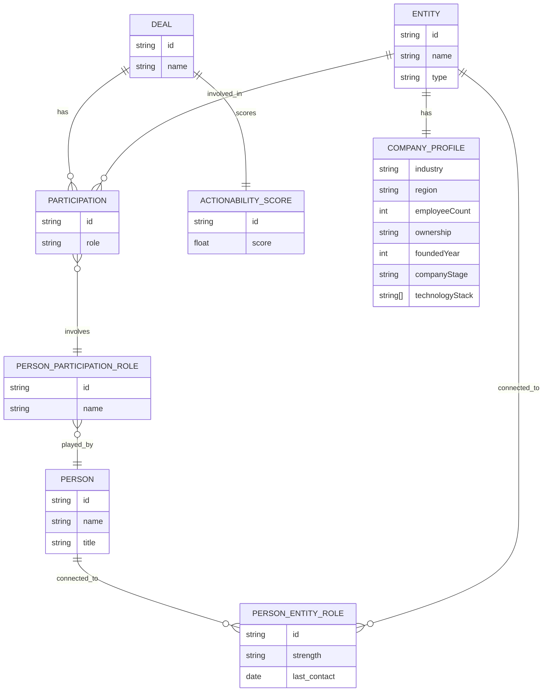
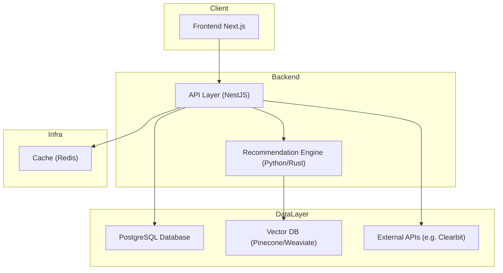

# System Design

## ER Diagram

Here's the core model for portraying deals in the database and all the relevant pieces:

- **Deal:** (e.g. Leveraged Buyout)
- **Entity:** An organization invovled in a deal (e.g. Investor, Advisor, Bank, Company)
- **Person:** An individual who may work at an entity and participate in deals
- **PersonEntityRole:** Relationship of person to entity
- **Participation:** An entity's involvment in a specific deal
- **PersonParticipationRole:** The role a person plays within a deal context
- **CompanyProfile:** Can contain details of a company from third party data providers
- **ActionabilityScopre:** A contextual score (user-specific) that indicates how likely a person or entity is to engage with a deal — based on relationship intelligence and deal fit.



## System Architecture



## Technical Choices

### PostgreSQL (Relational Database)

PostgreSQL is a battle-tested relational database that’s ideal for highly structured, relationship-heavy domains. SQL is well-suited for complex joins, filters, and aggregations, which are common in this type of relationship-driven system.

Additionally, PostgreSQL has great support for:

- JSONB fields (useful for third-party enrichment data)
- Full-text search (useful for fuzzy name matching)
- Common Table Expressions and window functions (ideal for querying relationship chains)

### Redis (Caching Layer)

While not strictly necessary for an MVP, Redis can be introduced as the system scales. It’s particularly useful for:

- Caching expensive, frequently-run queries (e.g., relationship paths)
- Storing ephemeral computation results (e.g., temporary scores or summaries)
- Reducing load on the primary database

This helps reduce response time and improves scalability under load.

### Next.js (Frontend) & NestJS (Backend)

These are modern, TypeScript-first frameworks with strong adoption in the startup ecosystem. They’re opinionated and modular, which helps maintain a clean architecture. Benefits include:

- Easy onboarding and hiring due to large communities
- Built-in support for SSR, routing, and state management (Next.js)
- Scalable and testable module structure (NestJS)

### Vector Database (e.g. Pinecone)

While speculative at the MVP stage, a vector database becomes useful once we introduce relationship intelligence and actionability scoring using machine learning or embeddings. Use cases include:

- Matching similar deals using embeddings generated via LLMs
- Powering a recommendation engine to suggest the most likely participants for a deal
- Performing semantic search on company and relationship profiles

### Python or Rust for Recommendation Engine

Python is a natural fit for ML workflows and prototyping. Rust becomes compelling when low-latency, high-throughput inference is required. These would likely be used in a sidecar service dedicated to actionability scoring and vector processing.

### Scalability considerations

1. **Evolving Person–Entity Relationships**
   A person’s relationship to an entity can change over time — they may switch jobs, change titles, or hold multiple roles. To keep the schema normalized and historically accurate, we separate:
    - Person–Entity roles (long-term employment)
    - Person–Deal roles (short-term deal participation)

2. **Data Enrichment at Scale**
   When integrating with external data sources like CoreSignal:
    - Store third-party data in separate tables or JSONB fields
    - Add batch enrichment workflows or event queues (e.g., via Pub/Sub or Kafka)
    - Use background jobs to enrich entities asynchronously

3. **Precomputed Scores & Analytics**
   Relationship intelligence and actionability scoring can be compute-heavy. As such:
    - Store precomputed scores for deals, entities, and users
    - Recompute scores periodically or when data changes significantly

4. **Event-Driven Architecture (optional later stage)**
   Introducing an event bus (e.g., Kafka, NATS, or Redis Streams) allows for:
    - Decoupling enrichment/scoring logic from the main API
    - Reacting to updates in deal participation, company enrichment, etc.

5. **Horizontal Scalability**
   The system can be horizontally scaled at the API layer (Next.js / NestJS)
    - PostgreSQL read replicas can support read-heavy workloads
    - Vector DBs like Pinecone are cloud-native and scale automatically


## Rest API Design

`GET /deals/:id`

Returns full details of a deal including participants, roles, and people.

```json
{
  "id": "deal_123",
  "name": "Leveraged Buyout of ABC Corp",
  "participants": [
    {
      "entity": {
        "id": "ent_1",
        "type": "Private Equity Firm",
        "name": "Blackstone"
      },
      "role": "Buyer",
      "people": [
        {
          "id": "p_1",
          "name": "Jane Doe",
          "title": "Managing Director"
        }
      ]
    },
    {
      "entity": {
        "id": "ent_2",
        "type": "Corporate Seller",
        "name": "XYZ Holdings"
      },
      "role": "Seller",
      "people": [
        {
          "id": "p_2",
          "name": "John Smith",
          "title": "CFO"
        }
      ]
    },
    {
      "entity": {
        "id": "ent_3",
        "type": "Investment Bank",
        "name": "Goldman Sachs"
      },
      "role": "Lender",
      "people": [
        {
          "id": "p_3",
          "name": "Alice Johnson",
          "title": "VP, Leveraged Finance"
        }
      ]
    },
    {
      "entity": {
        "id": "ent_4",
        "type": "Law Firm",
        "name": "Skadden, Arps, Slate, Meagher & Flom LLP"
      },
      "role": "Legal Advisor",
      "people": [
        {
          "id": "p_4",
          "name": "David Lee",
          "title": "Partner, M&A Practice"
        }
      ]
    },
    {
      "entity": {
        "id": "ent_5",
        "type": "Target Company",
        "name": "ABC Corp",
        "profile": {
          "industry": "Healthcare Services",
          "type": "North America",
          "employeeCount": 1200,
          "foundedYear": 2004,
          "ownership": "Private",
          "technologyStack": [
            "AWS",
            "Salesforce",
            "Snowflake"
          ]
        }
      },
      "role": "Target",
      "people": [
        {
          "id": "p_5",
          "name": "Rachel Green",
          "title": "CEO"
        }
      ]
    }
  ],
  "characteristics": {
    "dealType": "Leveraged Buyout",
    "industry": "Healthcare Services",
    "region": "North America",
    "dealSize": "500M",
    "currency": "USD",
    "date": "2024-10-15"
  },
  "actionabilityScore": 0.86
}
```

`POST /deals`

Create a new deal with entities, people, and roles.

`GET /recommendations`

Returns a ranked list of investors or advisors for a future deal
