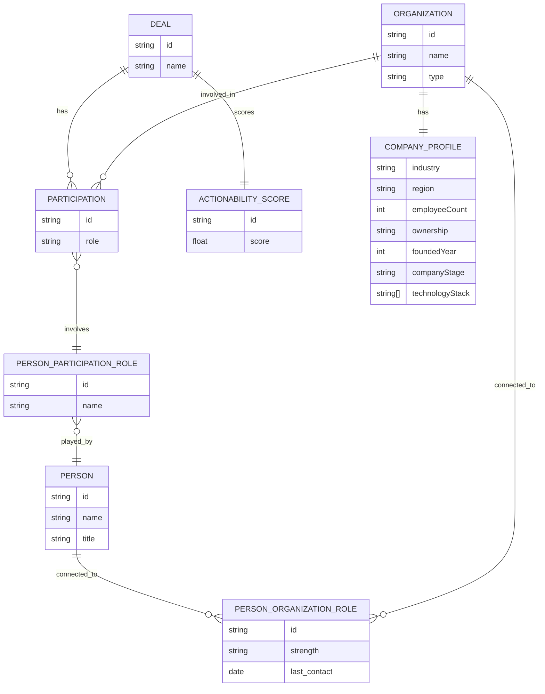
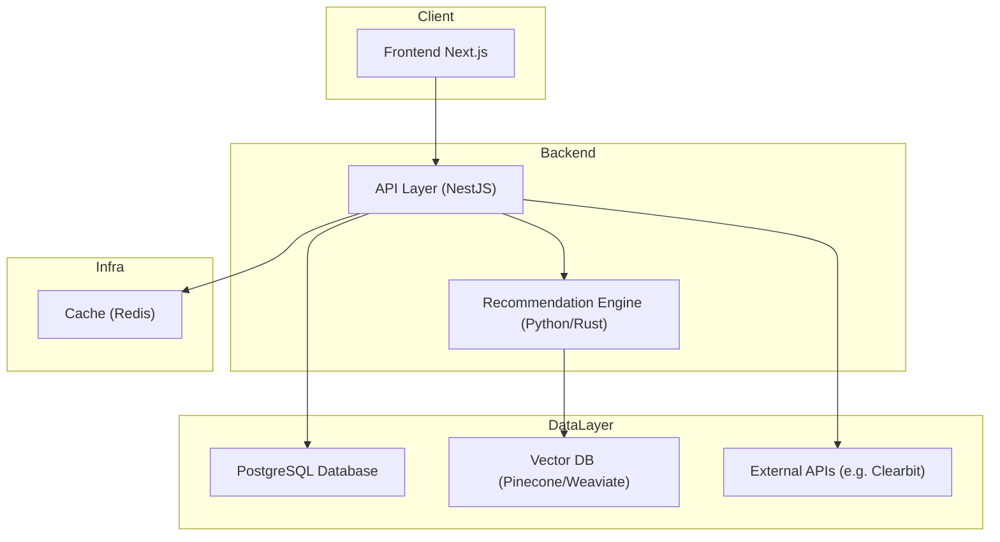
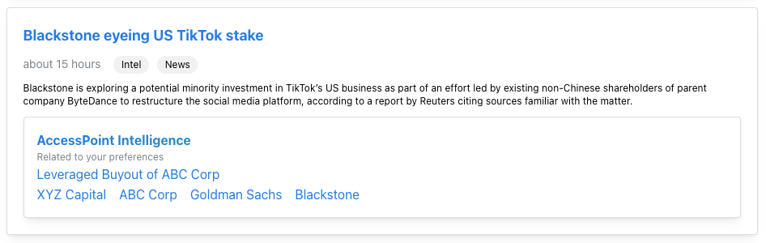

# AccessPoint Documentation

## ER Diagram

Here's the core model for portraying deals in the database and all the relevant pieces:

- **Deal**: Represents a transaction (e.g., Leveraged Buyout)
- **Organization**: Any firm involved in a deal (e.g., investor, advisor, bank, company)
- **Person**: An individual who may be affiliated with an organization and/or participate in deals
- **PersonOrganizationRole**: A person’s ongoing relationship to an organization (e.g., employment, advisory)
- **Participation**: An organization’s involvement in a specific deal
- **PersonParticipationRole**: A person’s role within a deal context (e.g., lead negotiator, legal counsel)
- **CompanyProfile**: Firmographic and enrichment data for organizations (typically sourced from third-party APIs)
- **ActionabilityScore**: A contextual, user-specific score estimating how likely a person or organization is to engage in a deal



## System Architecture



## Technical Choices

### PostgreSQL (Relational Database)

PostgreSQL is a battle-tested relational database that’s ideal for highly structured, relationship-heavy domains. SQL is well-suited for complex joins, filters, and aggregations, which are common in this type of relationship-driven system.

Additionally, PostgreSQL has great support for:

- JSONB fields (useful for third-party enrichment data)
- Full-text search (useful for fuzzy name matching)
- Common Table Expressions and window functions (ideal for querying relationship chains)

### Redis (Caching Layer)

While not strictly necessary for an MVP, Redis can be introduced as the system scales. It’s particularly useful for:

- Caching expensive, frequently-run queries (e.g., relationship paths)
- Storing ephemeral computation results (e.g., temporary scores or summaries)
- Reducing load on the primary database

This helps reduce response time and improves scalability under load.

### Next.js (Frontend) & NestJS (Backend)

These are modern, TypeScript-first frameworks with strong adoption in the startup ecosystem. They’re opinionated and modular, which helps maintain a clean architecture. Benefits include:

- Easy onboarding and hiring due to large communities
- Built-in support for SSR, routing, and state management (Next.js)
- Scalable and testable module structure (NestJS)

### Vector Database (e.g. Pinecone)

While speculative at the MVP stage, a vector database becomes useful once we introduce relationship intelligence and actionability scoring using machine learning or embeddings. Use cases include:

- Matching similar deals using embeddings generated via LLMs
- Powering a recommendation engine to suggest the most likely participants for a deal
- Performing semantic search on company and relationship profiles

### Python or Rust for Recommendation Engine

Python is a natural fit for ML workflows and prototyping. Rust becomes compelling when low-latency, high-throughput inference is required. These would likely be used in a sidecar service dedicated to actionability scoring and vector processing.

### Scalability considerations

1. **Evolving Person–Organization Relationships**
   A person’s relationship to an organization can change over time — they may switch jobs, change titles, or hold multiple roles. To keep the schema normalized and historically accurate, we separate:
    - Person–Organization roles (long-term employment)
    - Person–Deal roles (short-term deal participation)

2. **Data Enrichment at Scale**
   When integrating with external data sources like CoreSignal:
    - Store third-party data in separate tables or JSONB fields
    - Add batch enrichment workflows or event queues (e.g., via Pub/Sub or Kafka)
    - Use background jobs to enrich entities asynchronously

3. **Precomputed Scores & Analytics**
   Relationship intelligence and actionability scoring can be compute-heavy. As such:
    - Store precomputed scores for deals, entities, and users
    - Recompute scores periodically or when data changes significantly

4. **Event-Driven Architecture (optional later stage)**
   Introducing an event bus (e.g., Kafka, NATS, or Redis Streams) allows for:
    - Decoupling enrichment/scoring logic from the main API
    - Reacting to updates in deal participation, company enrichment, etc.

5. **Horizontal Scalability**
   The system can be horizontally scaled at the API layer (Next.js / NestJS)
    - PostgreSQL read replicas can support read-heavy workloads
    - Vector DBs like Pinecone are cloud-native and scale automatically


## Rest API Design

`GET /deals/:id`

Returns full details of a deal including participants, roles, and people.

```json
{
  "id": "deal_123",
  "name": "Leveraged Buyout of ABC Corp",
  "participants": [
    {
      "organization": {
        "id": "org_1",
        "type": "Private Equity Firm",
        "name": "Blackstone"
      },
      "role": "Buyer",
      "people": [
        {
          "id": "p_1",
          "name": "Jane Doe",
          "title": "Managing Director"
        }
      ]
    },
    {
      "organization": {
        "id": "org_2",
        "type": "Corporate Seller",
        "name": "XYZ Holdings"
      },
      "role": "Seller",
      "people": [
        {
          "id": "p_2",
          "name": "John Smith",
          "title": "CFO"
        }
      ]
    },
    {
      "organization": {
        "id": "org_3",
        "type": "Investment Bank",
        "name": "Goldman Sachs"
      },
      "role": "Lender",
      "people": [
        {
          "id": "p_3",
          "name": "Alice Johnson",
          "title": "VP, Leveraged Finance"
        }
      ]
    },
    {
      "organization": {
        "id": "org_4",
        "type": "Law Firm",
        "name": "Skadden, Arps, Slate, Meagher & Flom LLP"
      },
      "role": "Legal Advisor",
      "people": [
        {
          "id": "p_4",
          "name": "David Lee",
          "title": "Partner, M&A Practice"
        }
      ]
    },
    {
      "organization": {
        "id": "org_5",
        "type": "Target Company",
        "name": "ABC Corp",
        "profile": {
          "industry": "Healthcare Services",
          "type": "North America",
          "employeeCount": 1200,
          "foundedYear": 2004,
          "ownership": "Private",
          "technologyStack": [
            "AWS",
            "Salesforce",
            "Snowflake"
          ]
        }
      },
      "role": "Target",
      "people": [
        {
          "id": "p_5",
          "name": "Rachel Green",
          "title": "CEO"
        }
      ]
    }
  ],
  "characteristics": {
    "dealType": "Leveraged Buyout",
    "industry": "Healthcare Services",
    "region": "North America",
    "dealSize": "500M",
    "currency": "USD",
    "date": "2024-10-15"
  },
  "actionabilityScore": 0.86
}
```

`POST /deals`

Create a new deal with entities, people, and roles.

`GET /recommendations`

Returns a ranked list of investors or advisors for a future deal

## Mockup



## Product Notes

This mockup demonstrates a potential future direction for the platform’s newsfeed, powered by a contextual intelligence layer referred to here as AccessPoint Intelligence. This component provides users with a deeper understanding of the activity in their network and ecosystem by connecting real-time news with historical deal and relationship data.

### Core Value

AccessPoint Intelligence helps users:

- **Understand context:** Reveal who was involved in similar deals, or highlight relationships tied to people or firms mentioned in the news
- **Identify patterns:** Surface themes and recurring players across similar transactions
- **Act earlier:** Flag emerging deals and warm paths to engagement

### Implementation Philosophy

This is a vision-oriented feature, not something intended for immediate delivery. The goal of the mockup is to illustrate what this type of context-aware feed could enable. Real implementation would require:

- Structuring historical deal data for semantic comparison
- Mapping entities in unstructured text to known profiles
- Calibrating relevance models over time based on feedback and interaction data

### UX Scalability

To keep the experience intuitive and extensible, the feed uses tag-based categorization to differentiate event types. These tags ('Deal Update', 'Leadership Change', etc.) make it easy for users to scan, prioritize, and eventually filter based on their interests.

This prototype is just a starting point, but it aims to show how intelligence-driven personalization could be layered into the user experience in a meaningful and actionable way.

## Engineering Notes

The mockup illustrates a feature powered by AccessPoint Intelligence, designed to enrich the newsfeed with meaningful context. I’ve used “AccessPoint Intelligence” as a placeholder name to demonstrate how this capability could be positioned within a broader product ecosystem.

### Example capabilities include:

- **Highlighting Participant Histories**
  When a news story mentions entities involved in previous deals, AccessPoint Intelligence can surface relevant historical data about those participants directly in the feed.
- **Identifying Emerging Opportunities**
  By analyzing new deals and comparing them to past transactions, AccessPoint Intelligence can detect similarities and provide insights into related deals and their key participants. This enables users to proactively engage with potential opportunities early.

By integrating these capabilities, AccessPoint Intelligence transforms the newsfeed into a strategic tool for recognizing patterns, understanding market activity, and surfacing high-quality opportunities.

> Note: For illustrative purposes, the same AccessPoint Intelligence component is shown for each newsfeed item in the mockup. In a real implementation, this content would be dynamically generated based on the actual entities and deals referenced in each article.

While AccessPoint Intelligence represents a key part of the long-term vision, I don’t view this as something that should (or could) be implemented all at once. Building a robust contextual intelligence layer will require thoughtful iteration, cross-functional collaboration, and time to mature. This prototype is intended to show how the feature might eventually deliver significant value — starting small, learning from user feedback, and evolving as the product grows.

Finally, different types of newsfeed events are surfaced using simple, recognizable tags (e.g., `Deal Update`, `Leadership Change`, `Network Activity`). This approach keeps the interface clean and intuitive while supporting future filtering and categorization as the system evolves.

## Looking Ahead

Potential future extensions include:
- Embedding-based similarity matching for deals, firms, and news
- User profiles that explicitly influence personalization (e.g., sectors, roles, preferred deal stages)
- Ability to save or "track" deals and generate alerts
- Integration with internal CRM activity (e.g., introductions, meetings)
- Visualization tools to map deal relationships and paths to introductions
